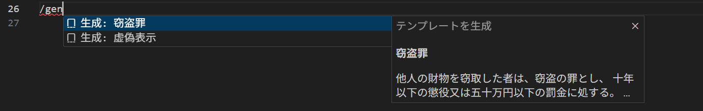
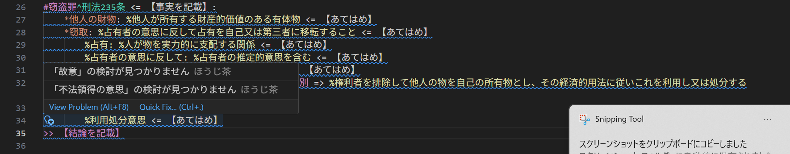

# ほうじ茶 (Houjicha) - 法的推論言語

法的推論を構造化して記述するためのドメイン固有言語（DSL）と、VS Code拡張機能です。


## 概要

ほうじ茶は、法律の条文解釈・要件検討・あてはめを形式的に記述できる言語です。法学の学習や答案作成の補助ツールとして使用できます。

## インストール

### VS Code拡張機能として使用

```bash
# リポジトリをクローン
git clone https://github.com/tatuut/houjicha.git
cd houjicha

# 依存関係をインストール
npm install

# ビルド
npm run build

# VS Code拡張機能としてパッケージ化
npx vsce package --allow-missing-repository

# 生成された .vsix ファイルをVS Codeにインストール
code --install-extension houjicha-lsp-0.1.0.vsix
```

## 基本構文

### 記号一覧


| 記号 | 意味 | 使用例 |
|------|------|--------|
| `#` | 主張（罪名・請求原因など） | `#窃盗罪^刑法235条` |
| `^` | 条文参照 | `#窃盗罪^刑法235条` |
| `<=` | あてはめ（事実の適用） | `#窃盗罪^刑法235条 <= 甲の行為` |
| `*` | 要件 | `*他人の財物` |
| `%` | 規範（定義・解釈） | `%他人が所有する有体物` |
| `?` | 論点 | `? 財物の意義` |
| `~>` | 理由 | `~> 電気など無体物の扱いが問題となる` |
| `=>` | 帰結（結論の導出） | `=> %有体物に限る` |
| `>>` | 効果（最終結論） | `>> 甲に窃盗罪が成立する` |
| `::` | 論述空間（名前空間） | `::刑法各論` |
| `/gen` | テンプレート生成 | 空行で `/gen` と入力 |

### 基本的な書き方

```houjicha
// 論述空間を定義（オプション）
::刑法各論

// 主張を開始
#窃盗罪^刑法235条 <= 甲の行為:
    // 要件を列挙
    *他人の財物: %他人が所有する財産的価値のある有体物 <= 本件時計はAの所有物
    *窃取: %占有者の意思に反して占有を移転 <= Aの意思に反して持ち去った

    // 論点がある場合
    ? 不法領得の意思の要否 ~> 財産犯と不可罰的な使用窃盗との区別 => %権利者排除意思と利用処分意思
        %権利者排除意思 <= あり
        %利用処分意思 <= あり

    // 主観的要件
    %故意 <= 認識認容あり

// 結論
>> 甲に窃盗罪が成立する
```

## VS Code機能

### 補完機能

#### 記号ガイド補完

空行で `Ctrl+Space` を押すと、使用可能な記号一覧が表示されます。


- トップレベルでは `#`, `::`, `/gen` が表示
- 主張内（インデント）では `*`, `%`, `?` などが表示

#### 段階的補完

`*` や `?` を入力して `Ctrl+Space` を押すと、候補が表示されます。


- `*` → 要件名の候補
- `?` → 論点名の候補
- `%` → 規範の候補

#### Ghost補完（記号ペア）

記号を入力すると、次の文字がゴーストテキスト（薄い文字）で表示されます。`Tab` キーで確定できます。


| 入力 | Ghost表示 | 結果 |
|------|-----------|------|
| `~` | `>` | `~>` |
| `=` | `>` | `=>` |
| `<` | `=` | `<=` |
| `>` | `>` | `>>` |
| `:` (行頭) | `:` | `::` |

### テンプレート生成 (`/gen`)

空行で `/gen` と入力して `Ctrl+Space` → テンプレートを選択すると、主張の雛形が生成されます。

**入力前：**


**生成後：**


### プレビュー機能

- `Ctrl+Shift+V` でプレビューパネルを開く
- リアルタイムで更新される
- 2つの表示形式：
  - **構造化**: リスト形式で要件の充足状況を表示
  - **答案形式**: 論文調の文章として表示

### アウトライン / 論証構造ビュー（開発中）

> **Note**: この機能は現在開発中です。以下は設計構想です。

サイドバーの「ほうじ茶」アイコンをクリックすると、ワークスペース内のすべての `.houjicha` ファイルを一覧表示する予定です。

**理想像：**
```
📁 ほうじ茶
├── 📄 刑法演習1.houjicha
│   ├── ::刑法各論
│   │   ├── #窃盗罪（刑法235条）[3/4充足]
│   │   │   ├── ✅ 他人の財物
│   │   │   ├── ✅ 窃取
│   │   │   ├── ⚠️ 不法領得の意思（論点あり）
│   │   │   └── ○ 故意
│   │   └── #詐欺罪（刑法246条）[5/5充足]
│   └── >> 甲に窃盗罪が成立する
├── 📄 民法演習1.houjicha
│   └── #売買契約に基づく代金請求 [2/2充足]
└── 📄 憲法答案.houjicha
    └── #表現の自由の侵害 [1/3充足]
```

**機能構想：**
- クリックで該当箇所にジャンプ
- 要件の充足状況をアイコンで表示（✅充足 / ❌不充足 / ⚠️論点あり / ○あてはめ済み / ・未検討）
- ドラッグ＆ドロップで構造を並び替え（将来）

### その他の機能

- **シンタックスハイライト**: 記号や構造に応じた色分け
- **ホバー情報**: 記号にカーソルを合わせると説明を表示
- **Go to Definition**: 定義元へジャンプ
- **診断（エラー表示）**: 構文エラーをリアルタイムで検出

## ファイル拡張子

- `.houjicha` - 標準拡張子
- `.hcha` - 短縮形

## 開発

```bash
# 開発モードで監視
npm run watch

# テスト実行
npm test

# Lint
npm run lint
```

## ライセンス

MIT License

## 貢献

Issue や Pull Request は歓迎です！

## 作者

- [@tatuut](https://github.com/tatuut)
