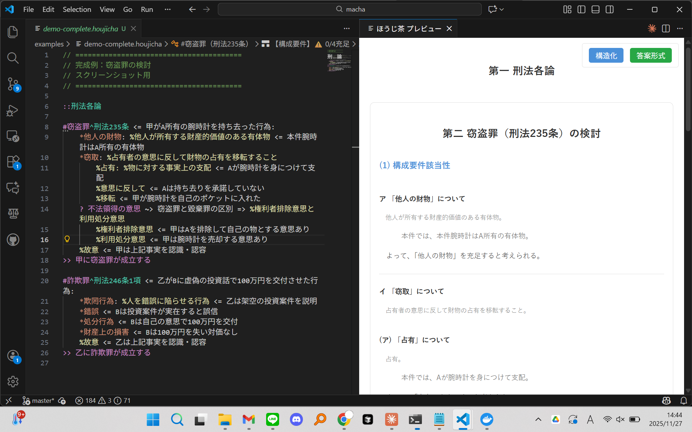
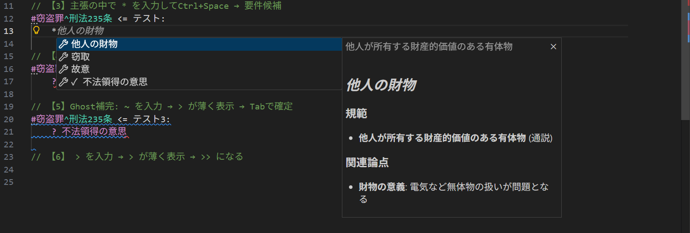
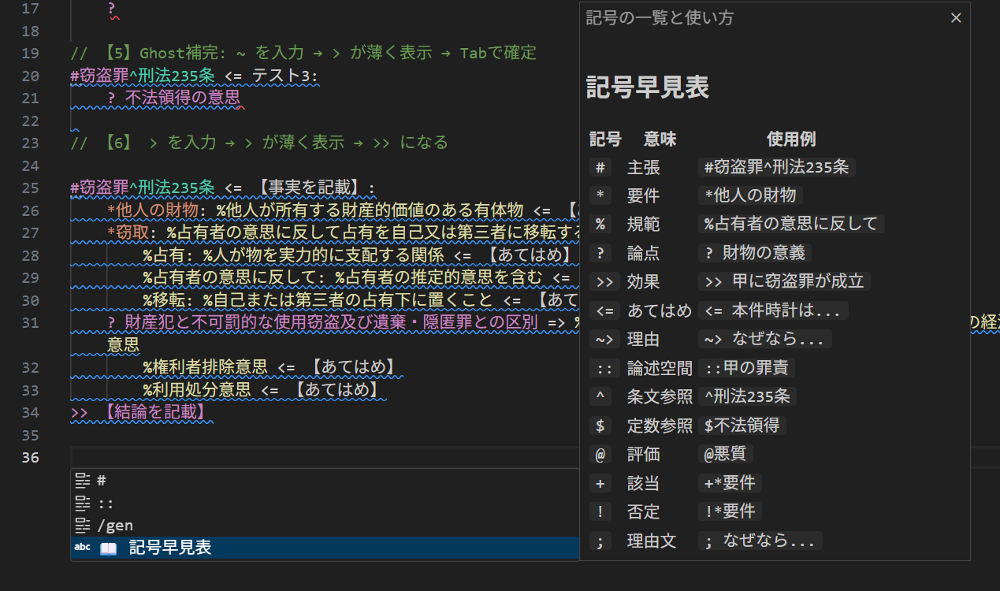
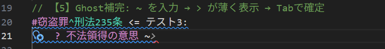

# Chai（チャイ）

```
                         ･゜°
                         :林川:
                       ゜川川森林;.             ..
                     川轟響森轟鬱°          :八;森林人;°
                     轟響森森轟響人           ;村村森林山
                     山森森森林響゜           °八山村村人
                     .村響轟森森°            ･川八八川;
                       轟響響鬱人             °;::人;
                     `鬱驫驫麟鬱山人川八゜°.･゜:;:;;`
                     八鬱驫麟龍森森森林森林山川川山人;:;人･
   .川山°         °林響鬱麟驫轟響森森響轟林林林林川川川山山
   山轟轟`       ･林鬱鬱森驫驫森鬱森轟響森山八;八川八八八八゜
   森轟川       川森驫驫轟鬱鬱響驫鬱響轟林
   ･森村.    ･山森驫驫驫響響驫驫麟響響山
   ･林林川°川林轟森驫麟麟麟鬱驫麟麟響森
     ･村森山森轟川　林麟麟麟驫麟麟龍鬱鬱`
       ･川村森;   `龍麟驫麟麟麟龍龍響山
           ゜°    ゜麟麟麟麟麟麟龍鑿驫轟.
                   麟麟麟麟麟麟麟龍龍鬱;      「法的三段論法を、もっと楽しく！」
                  °麟麟麟麟麟驫驫麟龍麟森゜              .
                  山驫麟麟驫轟驫麟麟麟龍川轟村川人八山林:
                  轟驫驫驫鬱林驫驫驫麟麟轟゜轟森村山川;゜
                 °驫驫驫驫轟村響驫驫鬱轟轟゜°村林山川村:
                 ;川林鬱驫森林響鬱森村森轟轟.･八林村:･
               .;八山村林林森森轟森村村林森響川  .;村
              ･:人山村山林森林森轟林林村森轟響森゜
           ･``人川村村村林轟轟轟森林村村森森響森村
          °;:;人村村村林森森森轟森林林森森森響森人:
            °人;川林村林森轟轟村村村森森森森轟村村;;:
             .:林林村森轟森林村川山森森森森森;°;゜.
                 °人林轟響轟村山山村林轟轟林`.
                    °響鬱驫°  .  村鬱響川
                     森鬱鬱人     響響響`
                     人鬱鬱山     響鬱轟
                     ･響鬱轟    `鬱鬱川
                      林驫鬱    :驫鬱`      ☕ ← Chai（チャイ）はいかがですか？
                      ;驫驫:   八驫鬱
                       鬱驫;   人驫川
                      .鬱鬱川  林鬱響.
                     .:驫麟林  `森驫:
                     村轟山･       川林;
```

---

## このプロジェクトについて

### Matchaとの出会い

Chaiは、[**Matcha**](https://www.elecode.jp/matcha) という素晴らしいプロジェクトに触発されて生まれました。

Matchaは「法律答案をコードする」ための専門言語です。法的推論を形式的に記述し、構造化された方法で表現できるツール——そのアイデアに強く惹かれました。

法律の答案を書くとき、私たちは常に同じ構造を繰り返します。
「規範を定立して、事実をあてはめて、結論を出す」——法的三段論法です。

でも、この構造は頭の中にあるだけで、明示的に書き出されることはありません。
だから、要件を一つ飛ばしてしまったり、論点の検討を忘れてしまったり。
答案を書き終わってから「あ、これ書き忘れた」と気づくことも。

プログラミングでコンパイラが「この変数は未定義です」と教えてくれるように、
「この要件はまだ検討されていません」と教えてくれる仕組みがあったら？

それがMatchaの目指すところでした。

### なぜ分岐したのか

Matchaは非常に面白いプロジェクトでしたが、OSSではありませんでした。
「こんな機能があったら便利だな」と思っても、参加する方法がなかったのです。

そして私には、もう一つの目的がありました。

**人間が使うことを主軸としない使い方——AIによる法的起案を加速させたい。**

AIによる法律業務の品質を最低限担保するためには、リンターエラー機能がどうしても必要でした。
AIが法的推論を生成したとき、「この要件が欠落しています」「この論点の検討を推奨します」と
フィードバックを返せる仕組み。それがなければ、AIの出力は構造的な品質チェックを受けられません。

そのために必要なのが **MCP（Model Context Protocol）** への対応です。

### LSPとゴーストライターの時代

CursorやGitHub Copilotの登場以降、AIを使った開発の形は大きく変わりました。

**ゴーストライター** ——AIが先読みして自動で補完候補を提案し、人間がTabで承認する。
この共同作業への移行が加速しています。

その際に必要なのは **LSP（Language Server Protocol）** です。
構文を自動解析し、エディタと連携する仕組み。VS CodeやCursorと統合できる基盤。

これがあれば、あとは自動補完用のLLMを作り、Chaiのデータで学習することで、
より実務家の思考過程や処理過程を補完するエコシステムが構築できます。

だから、**MCP対応**と**LSP実装**を主眼に据えて、このプロジェクトを始めました。

### 名前の由来

元々のインスピレーション元が「Matcha」という名前だったので、
同じお茶つながりで「Chai（チャイ）」と名付けました。

チャイはインドの各地方や家庭ごとに作り方が違います。
スパイスの配合も、煮出し方も、甘さも——みんなそれぞれの「マイ・チャイ」がある。
その下町感というか、「正解は一つじゃない」感じがこのプロジェクトに合っていると思いました。

それに、僕の周りにはインドにゆかりのある人が多いんです。
だから親しみを込めて、この名前にしました。

マスコットは「**チャイさん**」。一緒に法的三段論法を学んでいきましょう！

## 設計思想

### 学習コストは低く、汎用性は高く

Chaiを設計するうえで重視したのは、**学習コストを極力低く、汎用性を極力高く**ということです。

Matchaの構文は便利なところが多かったので極力これをベースにしつつ、VS Codeで使いやすいように調整しました。自動補完や`Ctrl+Space`でのヒントが使いやすくなるように。だから記号早見表は`Ctrl+Shift+H`でいつでも見られるようにしています。

### データの蓄積と再利用

AIは組み込んでいないので、条文データを`articles/`に登録する必要があります。

ある程度安定した論点はここにノート代わりに書くと、次回も使えるようになります。AIがここに登録するMCPツールもあるので、自動で蓄積されていくとベストです。

それより細かい「考えたこと」や「次も使いたいこと」は、まさに`.chai`ファイルに`as`や定数定義で書くことで再利用できる仕組みです。

### 形式と内容の峻別

Chaiは**一切法的な判断をしません**。

あくまで入力補助が主眼で、それができれば内容の賢さは他の言語やリンターと同じようにAIや人間がすべきだと考えています。

**Chaiがやること**:
- 入力補助（補完、テンプレート展開）
- エラー検出（バリデーション）
- データ提供（条文DB、要件・論点の候補）

**Chaiがやらないこと**:
- 契約書の解析（AIシステムの仕事）
- 法令適合性の判断（AIシステムの仕事）
- 事実認定（法律家の仕事）

プログラミングにおいてコンパイルエラーが「これじゃ動かない」と教えてくれるように、
Chaiは「この法的推論は構造的に成立しない」と教えてくれます。
でも、「この推論は正しい」とは言いません。それは人間やAIの仕事です。

---

## 将来やりたいこと

### ゴーストライティング（Tab補完）

```
%不法領得の意思 <= |
                   │
                   ▼
    ┌─────────────────────────────────┐
    │ 👻 甲は財布を自己の物として     │  ← AIゴースト提案
    │    利用処分する意思を有していた │
    └─────────────────────────────────┘
                   │
                   │ Tab
                   ▼
%不法領得の意思 <= 甲は財布を自己の物として利用処分する意思を有していた
```

AIが先読みして補完候補を提案し、人間がTabで承認する。
この共同作業を実現するために、LSPを実装しています。

### 法的権威充足構造

法学では何かを確定させるときに「それが何の権威に支えられているか」を常に考えます。
権威は固定的な階層ではなく、**通用力**（みんながこれを基準にしている度合い）によって動的に決まります。

```
【第1層：最高規範】
└── 憲法、条約

【第2層：法的拘束力あり（通用力が確立）】
├── 法律（国会制定法）
├── 政令・省令・条例（委任に基づく）
├── 最高裁判例（裁判所は逆らえない）
├── 通説（通用力が確立したもの）
└── 行政解釈（行政相手の訴訟では拘束力あり）

【第3層以下：通用力によって可変】
├── 高裁判例
├── 地裁判例
├── 有力説
├── 学説
└── etc.
```

この構造の詳細な実装は将来のAIエコシステム設計で検討します。
通用力は事案ごとに調整が必要で、思考ルールとしてAIに伝える方が適切だと考えています。

### RAGベースアーキテクチャ

**「実体はベクトル、関係だけ保持」**

```
┌─────────────────────────────────────────────────────────┐
│  RAG空間（ベクトルDB）                                   │
│                                                         │
│    ● vec_001「不法領得の意思」                           │
│    ● vec_002「権利者排除意思」                           │
│    ● vec_003「甲が財布を持ち去った」                      │
│                                                         │
└─────────────────────────────────────────────────────────┘
                    │
                    │ ベクトルID参照
                    ▼
┌─────────────────────────────────────────────────────────┐
│  構文ファイル（関係性グラフ）                             │
│                                                         │
│    # 窃盗罪                                              │
│      └─[要件]─→「窃取」                                  │
│            └─[規範]─→ % vec_005                         │
│                  └─[あてはめ]─→ vec_003                 │
│                                                         │
└─────────────────────────────────────────────────────────┘
```

**メリット**:
1. **概念の正規化**: 同じ意味は同じベクトルに収束
2. **検索効率**: テキスト全文ではなくベクトル類似度で検索
3. **クロスファイル**: 別ファイルの関連箇所が自動で見つかる
4. **AI連携**: ベクトル空間はLLMと相性が良い

---

## 使い方

### インストール

1. `.vsix`ファイルをダウンロード
2. VS Codeで`Extensions: Install from VSIX...`を実行
3. `.chai`ファイルを開く

### エディタ画面

左側でChai構文を書くと、右側にリアルタイムでプレビューが表示されます。



### キーバインド

| キー | コマンド |
|------|---------|
| `Ctrl+Space` | 補完候補を表示 |
| `Ctrl+Shift+V` | プレビューを開く |
| `Ctrl+Shift+H` | 記号早見表を表示 |

### 補完機能

#### 罪名・条文の補完

`#`を入力して`Ctrl+Space`を押すと、罪名の候補が表示されます。選択すると条文も確認できます。


#### 要件の補完

`*`を入力して`Ctrl+Space`を押すと、その罪名に対応する要件候補が表示されます。規範や関連論点も一緒に確認できます。



### 記号早見表

`Ctrl+Shift+H`で記号早見表を表示できます。各記号の意味と使用例が一覧で確認できます。



### Ghost補完（将来機能）

`~`を入力すると、AIが先読みして補完候補を薄く提案します。Tabで確定できます。



### サンプルファイルで体験！

まずはサンプルファイルを開いて、実際に手を動かしてみてください：

- [demo-try-commands.chai](./examples/demo-try-commands.chai) - **まずはこれ！** 補完機能を試せるファイル

完成例も参考にどうぞ：

- [demo-complete.chai](./examples/demo-complete.chai) - 窃盗罪の完全な論証例
- [demo-civil.chai](./examples/demo-civil.chai) - 民法（虚偽表示）の例

---

### バグ報告・機能要望の出し方

プログラミング初心者の方も大歓迎！以下の手順でお気軽にどうぞ。

#### 1. GitHubアカウントを作る
[github.com](https://github.com) でアカウントを作成（無料）

#### 2. Issueを作成する
1. [Issues ページ](https://github.com/tatuut/houjicha/issues) を開く
2. 右上の「**New issue**」ボタンをクリック
3. タイトルと本文を書いて「**Submit new issue**」

#### 3. 書き方のコツ

**バグ報告の場合：**
```
タイトル: [バグ] ○○すると△△になる

本文:
【やったこと】
1. ○○を入力した
2. Ctrl+Spaceを押した

【期待した動作】
△△が表示されるはず

【実際の動作】
何も起きない / エラーが出る

【環境】
- OS: Windows 11 / Mac
- VS Codeバージョン: 1.xx
```

**機能要望の場合：**
```
タイトル: [要望] ○○できるようにしたい

本文:
【やりたいこと】
○○のときに△△したい

【理由・背景】
こういう場面で困っている / こうなると便利
```

#### お願い
- **勝手にコードを変更しないでください**（Issue で相談してから！）
- スクリーンショットがあると分かりやすいです
- 同じ問題が既に報告されていないか、先にIssueを検索してみてください

### Pull Request（コード貢献）の出し方

「自分でコードを直したい！」という方向けの手順です。

#### どんなときにPRを出す？

- **条文データの追加**: `articles/` に新しい条文YAMLを追加したい
- **サンプルファイルの追加**: こんな例があると分かりやすい！
- **ドキュメントの修正**: 誤字脱字、説明の改善
- **バグ修正**: Issue で相談済みの問題を自分で直したい

#### 手順

##### 1. まずIssueで相談（重要！）
いきなりPRを出さないでください。先にIssueで「これやりたいんですけど」と相談しましょう。
方針がズレていると、せっかく書いたコードが無駄になってしまいます。

##### 2. リポジトリをForkする
1. [houjicha のページ](https://github.com/tatuut/houjicha) を開く
2. 右上の「**Fork**」ボタンをクリック
3. 自分のアカウントにコピーが作られる

##### 3. 自分のPCにクローン
```bash
git clone https://github.com/あなたのユーザー名/houjicha.git
cd houjicha
npm install
```

##### 4. ブランチを作って作業
```bash
# 作業用ブランチを作成（名前は作業内容が分かるように）
git checkout -b add-civil-code-95

# ファイルを編集...

# 変更を確認
git status
git diff

# コミット
git add .
git commit -m "条文データ: 民法95条（錯誤）を追加"
```

##### 5. 自分のForkにプッシュ
```bash
git push origin add-civil-code-95
```

##### 6. Pull Requestを作成
1. 自分のForkページを開く
2. 「**Compare & pull request**」ボタンが表示されるのでクリック
3. タイトルと説明を書く
4. 「**Create pull request**」をクリック

#### PRの書き方

```
タイトル: 条文データ: 民法95条（錯誤）を追加

本文:
## 概要
民法95条の条文データを追加しました。

## 関連Issue
#12 （あれば）

## 変更内容
- articles/civil/95.yaml を新規作成
- 要件: 錯誤、重要性、因果関係
- 論点: 動機の錯誤の扱い

## 確認したこと
- [x] npm run build が通る
- [x] npm test が通る
```

#### 具体例1：条文データを追加する場合

例えば「民法95条（錯誤）」を追加したい場合：

1. Issue で「民法95条を追加したいです」と相談
2. OKが出たら Fork → Clone
3. `articles/civil/95.yaml` を作成：
```yaml
id: civil-95
name: 錯誤
article: 民法95条
requirements:
  - name: 錯誤
    description: 意思表示に対応する意思を欠くこと
  - name: 重要性
    description: 法律行為の目的及び取引上の社会通念に照らして重要なもの
issues:
  - name: 動機の錯誤
    description: 動機が表示されていたか
```
4. コミット → プッシュ → PR作成

#### 具体例2：「こんな機能がほしい！」場合

例えば「全角スペースを使うと警告を出してほしい」という機能要望の場合：

**Step 1: まずIssueで相談**
```
タイトル: [要望] 全角スペースを警告してほしい

本文:
【やりたいこと】
全角スペースを入力したとき、警告を表示してほしい。
できれば半角に自動変換するQuickFixもほしい。

【理由・背景】
日本語IMEで入力していると、気づかず全角スペースが混入する。
∵ の後に全角スペースを入れると補完が効かなくなって困った。
```

**Step 2: 議論を経て方針決定**
- メンテナーから「いいですね！DiagnosticSeverity.Warningで実装しましょう」など返信
- 実装方針が固まったら「自分でやってみます」と宣言

**Step 3: 実装してPR**
```
タイトル: feat: 全角スペースの警告とQuickFixを追加

本文:
## 概要
全角スペース（U+3000）を検出して警告を表示し、
半角スペースに置換するQuickFixを追加しました。

## 関連Issue
Closes #15

## 変更内容
- src/lsp/server.ts: detectFullWidthSpaces() 関数を追加
- src/lsp/server.ts: QuickFixでの置換処理を追加

## 確認したこと
- [x] npm run build が通る
- [x] npm test が通る
- [x] 実際にVS Codeで警告が表示される
- [x] QuickFixで半角に置換できる
```

**ポイント:**
- `Closes #15` と書くと、PRがマージされたときにIssueが自動で閉じる
- スクリーンショットや動画があると分かりやすい
- テストを追加するとさらに良い

#### よくある失敗
- ❌ Issueで相談せずにいきなりPR → 方針違いで却下されがち
- ❌ mainブランチで直接作業 → 後でごちゃごちゃになる
- ❌ 大きすぎる変更を一度に → レビューが大変、分割しましょう

---
## ロードマップ

### Phase 1: 基盤強化 ✅ 完了
- [x] 基本構文のパーサー
- [x] LSPサーバー
- [x] VS Code拡張
- [x] YAMLデータベース
- [x] 行内複合構文
- [x] 規範ネスト
- [x] 思考過程メモ（`∵`）

### Phase 2: 補完システム 🚧 進行中
- [ ] db-search モード
- [ ] candidate-cycle モード
- [ ] InlineCompletionProvider

### Phase 3: AI連携
- [ ] ai-generate モード
- [ ] Tab補完でゴースト受け入れ
- [ ] 文脈を考慮した提案

### Phase 4: RAGアーキテクチャ
- [ ] ベクトル化パイプライン
- [ ] 関係性グラフの保存形式設計
- [ ] クロスファイル参照
- [ ] 概念の自動提案

---

## 参加してください！

このプロジェクトはOSSです。

- 「こんな機能がほしい」
- 「この構文はこうした方がいい」
- 「条文データベースを充実させたい」

やりたいことがある人、ぜひ参加してください！

Claude Opus 4.5が一発でLSPを作れるようになった時代、こういうプロジェクトも現実的になりました。

---

## クレジット

このプロジェクトは [Matcha](https://www.elecode.jp/matcha) のアイデアに触発されて生まれました。
法律答案をコードするという素晴らしい発想に感謝します。

---

> 「チャイさんと一緒に、法的三段論法をもっと楽しく！」
>
> `.chai` ファイルで書けるよ！
> それじゃあ、よい法的三段論法ライフを！
